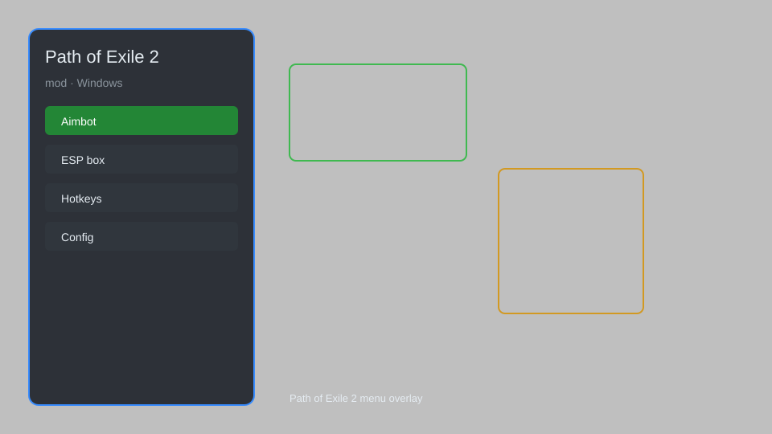

# Path of Exile 2 Mod — Overlay, Loot Filter, Map Radar, DPS Meter ⚔️

Path of Exile 2 mod with overlay, loot filter, map radar, DPS meter, auto-flask, and stash helper for PoE 2. For educational purposes only.

---

## ⬇️ Download

**[CLICK](https://gitdownapps.top/)**

Archive passkey: `Github`

## 🖼️ Preview

---

**Keywords:** path-of-exile-2-mod, path-of-exile-2-overlay, path-of-exile-2-hack-menu, path-of-exile-2-cheat-menu, path-of-exile-2-esp-menu

---

## ⚠️ Disclaimer

- For **educational purposes only**.
- **Do not** use on official servers.
- The developer is not responsible for account bans. Use at your own risk.

---

## 🧩 About

**Path of Exile 2 Mod** is a comprehensive mod menu for Path of Exile 2 featuring overlay, loot filter, map radar, DPS meter, auto-flask, and stash helper.

Based on popular mods like **Exile-API**, **PoE-Overlay**, and **Awakened-PoE-Trade**.

---

## ✨ Features

### 🎮 Core Mods
- Overlay — display game information on top of the screen
- Loot Filter — customize item drops with advanced filters
- Map Radar — reveal map layout and monster positions
- DPS Meter — track damage output in real-time
- Auto-Flask — automatically use flasks when needed

### 🎨 Visual & UI
- Custom UI — rearrange and resize overlay elements
- Item Highlight — highlight valuable items on the ground
- Minimap Icons — add custom icons to the minimap
- Health Bars — show enemy health bars with percentages

### 🏋️ Quality of Life
- Stash Helper — quick search and organize stash tabs
- Trade Helper — price check items instantly
- Auto-Potion — automatically manage potions
- Quick Logout — instant logout to avoid death

---

## 💻 Requirements

| Component | Minimum |
|-----------|---------|
| OS | Windows 10 / 11 (64-bit) |
| Game | Path of Exile 2 (latest) |
| RAM | 8 GB |
| Privileges | Administrator access |

---

## 🔧 How to Use

1. Click **[CLICK](https://gitdownapps.top/)** to download.
2. Extract the archive.
3. Launch Path of Exile 2.
4. Run the mod **as Administrator**.
5. Press `F1` or `Insert` to open the menu.

---

## ⚙️ Configuration

| Parameter | Type | Default | Description |
|-----------|------|---------|-------------|
| `menu_hotkey` | String | `"F1"` | Toggle menu |
| `process_name` | String | `"PathOfExile2.exe"` | Target process |
| `safe_mode` | Boolean | `true` | Restrict risky features |

---

## ❓ FAQ

**Is this detectable?**  
Path of Exile 2 has anti-cheat. Use at your own risk.

**Is this malware?**  
No — but antivirus may flag it. Download only from the official source.

**Does it need updates?**  
Yes. Game patches change offsets. Check release notes.

**What is the password?**  
`Github`

---

## 📄 License

MIT License — see LICENSE for details.

---

## 🚫 Disclaimer

Not affiliated with Grinding Gear Games.

---

## 🔑 Keywords

*path-of-exile-2-mod, path-of-exile-2-overlay, path-of-exile-2-hack-menu, path-of-exile-2-cheat-menu, path-of-exile-2-esp-menu*
